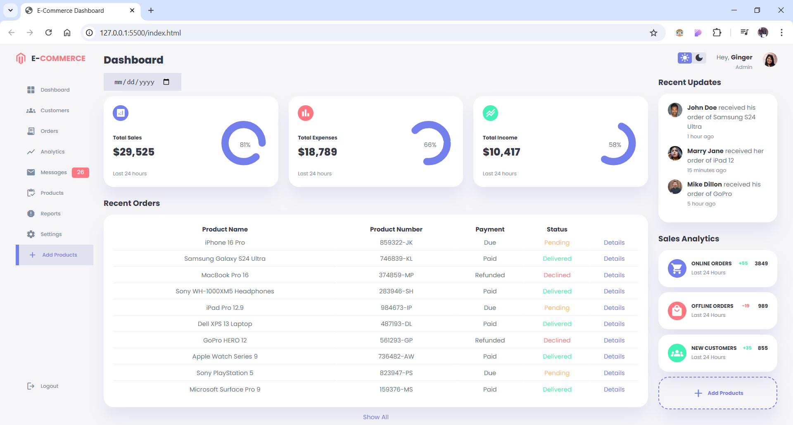

# Responsive Admin Panel

This project is a **responsive admin panel** designed for desktop, tablet, and mobile devices. The layout is clean, modern, and intuitive, ensuring a seamless user experience across different screen sizes.

## Features

### Layout Structure

- **Aside (Sidebar):**

  - Contains logo and application name.
  - Contains navigational links such as Dashboard, Customers, Orders, Analytics, Messages, Products, Reports, Settings and logout.

- **Main Section:**

  - Displays an overview of key metrics:
    - **Total Sales:** Highlights sales figures for the last 24 hours.
    - **Total Expenses:** Summarizes expense data.
    - **Total Income:** Displays net income for the last 24 hours.
    - **Recent Orders:** Lists the latest orders with details on product names, payment status (Paid, Due, Refunded), and delivery status.
    - A "Show All" option for expanded order details.

- **Right Section:**
  - Includes an Admin name and profile picture section.
  - Includes a toggle for light/dark mode.
  - Displays **Recent Updates** for user activities (e.g., order confirmations).
  - **Sales Analytics** section categorizes data for online orders, offline orders, and new customers.
  - An "Add Products" button and a logout option are also included.

### Design

- Fully responsive for various devices (desktop, mobile, and tablets).
- Uses a clean and modern UI with a user-friendly experience.
- Color-coded indicators for statuses (e.g., Pending, Delivered, Declined).

## How to Use

- Clone the repository to your local machine and run the index.html page in your favorite browser.

## Technologies Used

- HTML/CSS and vanilla JavaScript

## Screenshots

## License

This project is licensed under the MIT License. See the [LICENSE](LICENSE) file for details.
